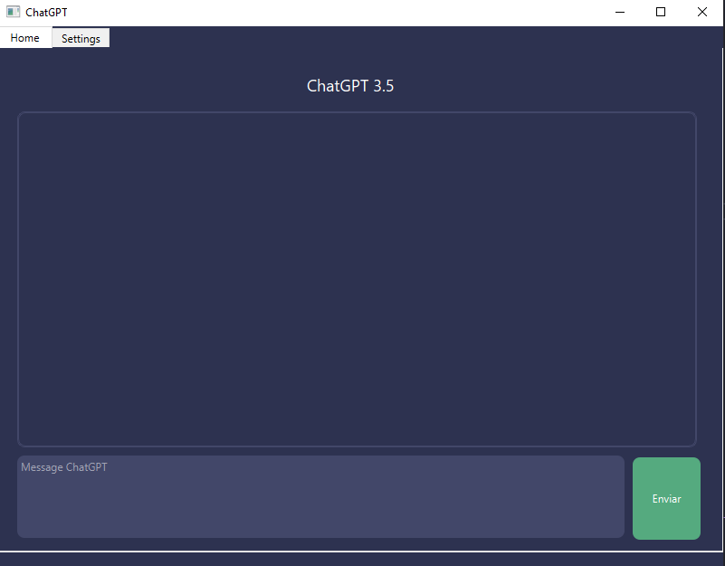
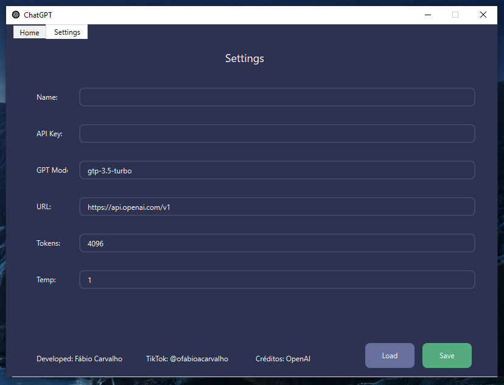
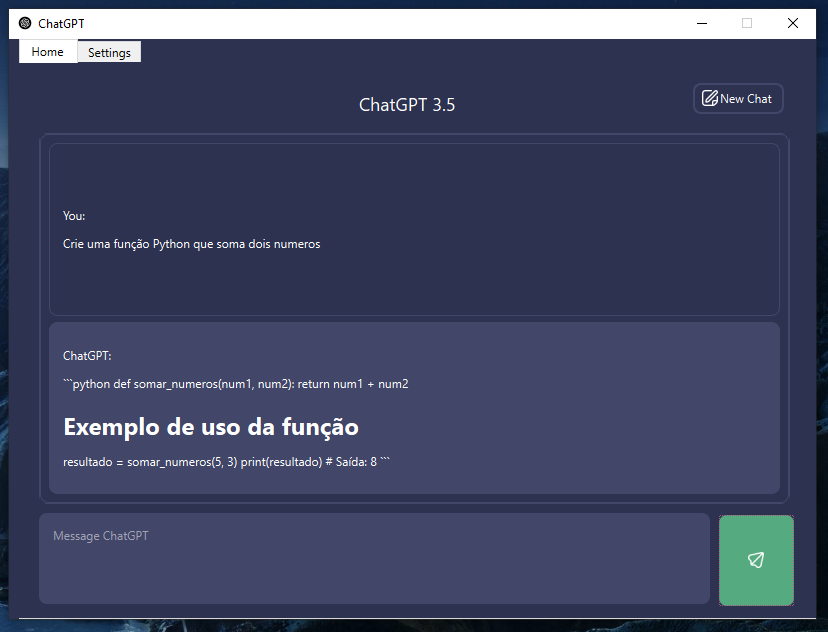

# ChatGPT Desktop

Aplicativo Desktop para utilizar o chatGPT com sua API Key.



<br>



<br>



## Executável (Windows)

Entre na pasta `app` e baixe o arquivo `My-Personal-GPT.exe`, após isso só ir até o local de downlaod e executar.

### Definindo configurações do App

Crie sua conta na [OpenAI](https://openai.com/) e crie uma API-Key.

Feito isso basta adicionar no settings da aplicação sua API-Key.


## Instalação
Rode o comando abaixo para instalar as bibliotecas:

```powershell
pip install -r requirements.txt
```
## Atualizar o desgin
A arquivo de design está na pasta inter > design.ui para acessar o mesmo basta abrir o arquivo no aplicativo QT Designer que pode ser baixado pelo link abaixo:

> Pasta 'inter' significa interface.

## Aplicativo: Qt Designer

Após a instalação basta abrir o arquivo e realizar as alterações necessárias. Lembrando de salvar o arquivo na mesma pasta novamente.

## Atualizando o arquivo design.py

Para atualizar o arquivo design.py basta acessar a pasta inter e rodar o comanado abaixo:

```powershell
pyside6-uic inter/design.ui -o inter/design.py
```

## Gerando executável
Precisamos instalar o PyInstaller:

```powershell
pip install pyinstaller
```

Para gerar um arquivo .exe exwecute o comando:

```powershell
pyinstaller --onefile -w main.py
```

---

## Informações Complementares

### Paleta de cores:

- #676F9D
- #424769
- #2D3250
- #55AA7F